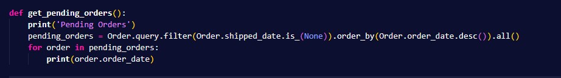
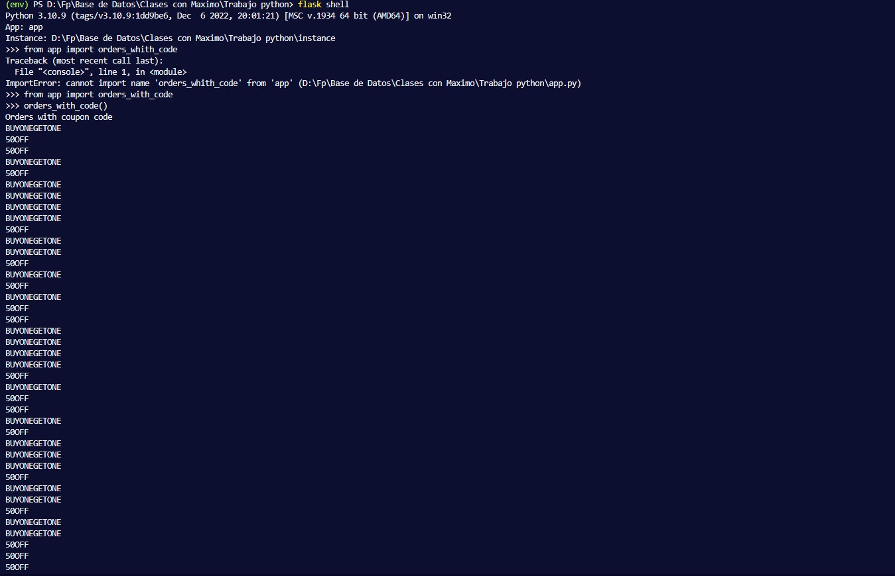

# flask - SQLAlchemy

##Instalacion

 
 Para usar flask y sqlalchemy, creamos un espacion virtual env que como podemos ver en la captura tenemos ya instanciado 
---

Ahora para tener en este entorno instalamos con el comando pip el flask y el flask-sqlalchemy 
---

Ahora en nuesto archivo de python creamos las bases de nuestra base de datos, primero creamos nuestras tablas con sus enlaces. En la siguiente captura se puede ver las 3 tablas creadas, customer order y products  

---

En esta captura podemos ver como se ha creado la base de datos, mediante el flask shell, y con el sqlite3 podemos ver las tablas y su schema

---

##Queries

En esta querri tenemos que añadir a nuestra base de datos 100 cusmer, que los creamos con la funcion add_customers que va creando uno a uno hasta 100 customers y los añade. 
Con add_orders añade 1000 ordenes una a una.
Con add_products añadimos 10 productos a nuestra base de datos 

Ahora adjunto el codigo resulta de los customer de nuestra base de datos 

---

En esta querri tenemos que imprimir las orders de la base da datos y ordenarlos por el customer id y imprimimos el order_date de cada uno de las orders 

Ahora adjunto el codigo resultante 

---

En esta querri tenemos que imprimir las orders pendientes las cuales se ordenaran de manera descendenete 

Ahora adjunto el codigo resultante 

---

En esta querri tenemos que imprimir el numero de customer que hay en la tabla, el cual con un count se imprime

Ahora adjunto el codigo resultante 

---

En esta querri tenemos que imprimir todos los codigos de las orders, pero sin que el codigo 'FREESHIPPING', por lo cual, acemor un filtro para que no haya ninguno vacion y ademas otro para que no sea del que no queremos y entonces los imprimimos

Ahora adjunto el codigo resultante 

---

En esta querri tenemos que imprimir los dias que faltan para el renove pasados tantos dias, por ello tenemos que sumar todos los dias, ademas de hacer joins para saber que dias tenemos que sunmar y con las tablas lo podemos encontrar

Ahora adjunto el codigo resultante 

---

En esta querri tenemos que imprimir la media de todos los ordes.shipped_date 

Ahora adjunto el codigo resultante 

---

